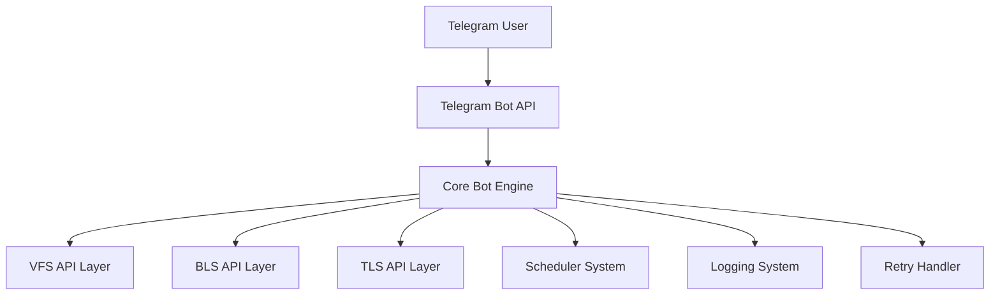

# 🚀 Visa VFS BLS TLS 

<div align="center">


<br/>


</div>

## ⚡ Overview

A high-performance Telegram Bot automation system integrated with
multiple external APIs for:

-   VFS Global systems 🌍\
-   BLS appointment platforms 📅\
-   TLS contact services 📞

------------------------------------------------------------------------

## 🌍 Supported Regions

-   🇲🇦 Morocco --- VFS / TLS / BLS flows\
-   🇩🇿 Algeria --- Appointment automation system\
-   🇵🇰 Pakistan --- Multi-service integration

------------------------------------------------------------------------

## 🧠 System Architecture



------------------------------------------------------------------------

## ✨ Features

-   Multi-service API integration\
-   Real-time request handling\
-   Smart routing system\
-   Auto retry mechanism\
-   Multi-country support

------------------------------------------------------------------------

## 📂 Project Structure

``` bash
telegram-bot/
├── bot.py
├── config.json
├── vfs_api.py
├── bls_api.py
├── tls_api.py
├── handlers/
├── utils/
└── requirements.txt
```

------------------------------------------------------------------------

## ⚙ Installation

``` bash
pip install -r requirements.txt
```

------------------------------------------------------------------------

## ▶ Run

``` bash
python bot.py
```


## 👁 Visitor Counter

<div align="center">


</div>

---

## 📞 Contact

<div align="center">

<a href="mailto:Advinistrator@gmail.com">

</a>

<a href="https://wa.me/201286016083">

</a>

<a href="https://github.com/OnlineUnknowns">

</a>

</div>

---

## ⭐ Support

[](https://buymeacoffee.com/onlineunknowns)

------------------------------------------------------------------------

